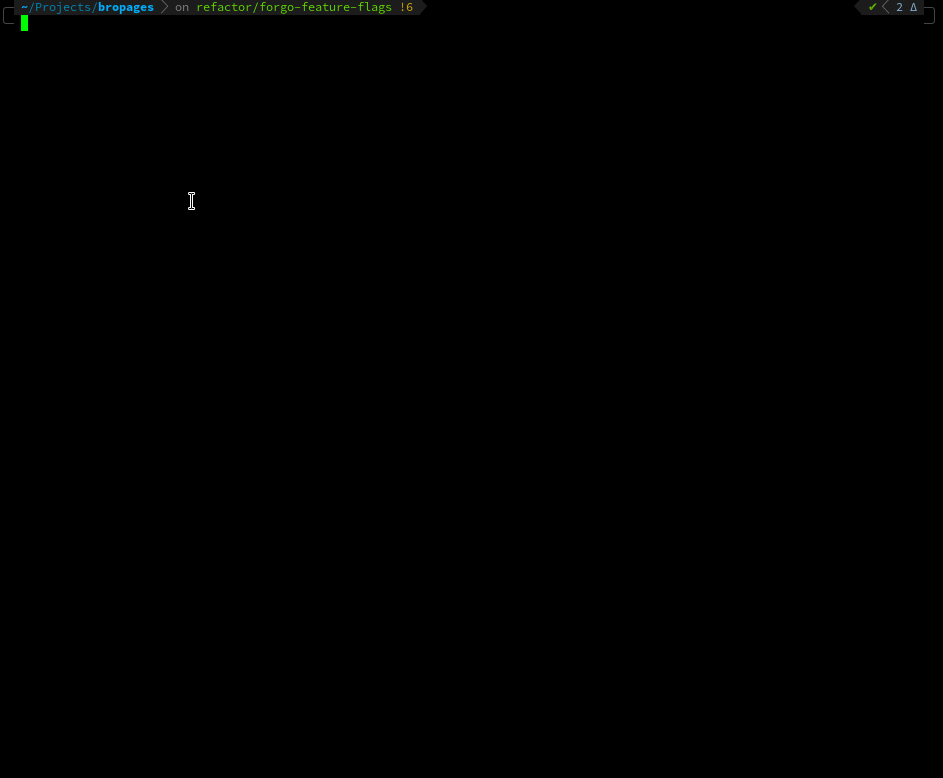

bropages (bro)
------------
A CLI to interact with [bropages.org](http://bropages.org).

Highly readable supplement to man pages. Shows simple, concise examples for commands with syntax highlighting.

[](https://crates.io/crates/bropages)


### Screencast

[](./screencast.gif)

### Installation

The binary name for bropages is `bro`.

Currently `bropages` is only available through `cargo`.
```
cargo install bropages
```

### Available options
```
USAGE:
    bro [OPTIONS] <query>

ARGS:
    <query>
            Command to lookup

OPTIONS:
    -h, --help
            Print help information

        --list-themes
            Display a list of supported themes for syntax highlighting.

        --no-paging
            Disable piping of the output through a pager

    -s, --search
            Search if provided query exist in the database
            This searches for entries in the http://bropages.org database

    -t, --theme <theme>
            Set the theme for syntax highlighting, default is `OneHalfDark`. Use '--list-themes' to
            see all available themes.

            [possible values: 1337, Coldark-Cold, Coldark-Dark, DarkNeon, Dracula, GitHub, "Monokai
            Extended", "Monokai Extended Bright", "Monokai Extended Light", "Monokai Extended
            Origin", Nord, OneHalfDark, OneHalfLight, "Solarized (dark)", "Solarized (light)",
            "Sublime Snazzy", TwoDark, "Visual Studio Dark+", ansi, base16, base16-256,
            gruvbox-dark, gruvbox-light, zenburn]

    -V, --version
            Print version information
```

### Note

- This is an unofficial rust port of [ruby bropages](https://rubygems.org/gems/bropages).
- I don't have any intentions to add the `add`, `no`/`...no` or `thanks` commands.

### TODO
 - [ ] Cache results ?
