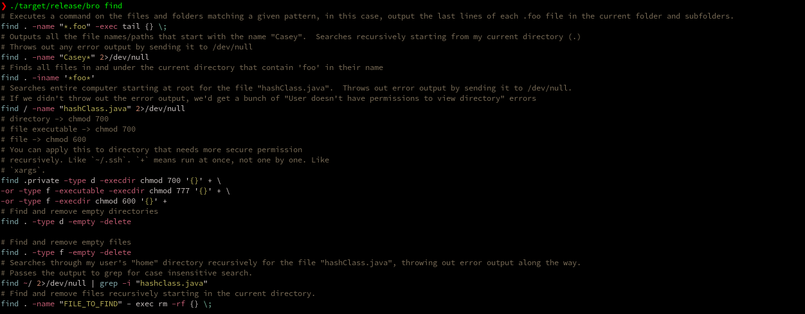

bropages (bro)
------------
A CLI to interact with [bropages.org](http://bropages.org).

Highly readable supplement to man pages. Shows simple, concise examples for commands.

[](https://crates.io/crates/bropages)


### Screenshot

[](./screenshot.png)

### Installation

The binary name for bropages is `bro`.

Currently `bropages` is only available through `cargo`.
```
cargo install bropages
```

### Available options
```
bropages 0.1.0
Highly readable supplement to man pages.
Shows simple, concise examples for commands.

USAGE:
    bro [FLAGS] <query>

FLAGS:
    -h, --help
            Prints help information

    -l, --lookup
            Lookup an entry, bro, or just call bro
            This looks up entries in the http://bropages.org database.
    -V, --version
            Prints version information


ARGS:
    <query>
            Command to lookup

```

### TODO:
 - [ ] Pager support
